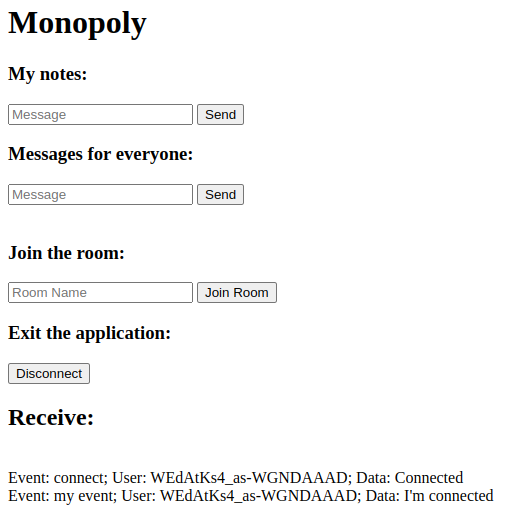
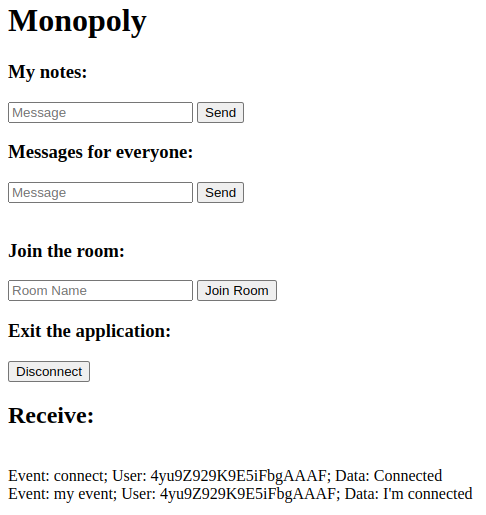
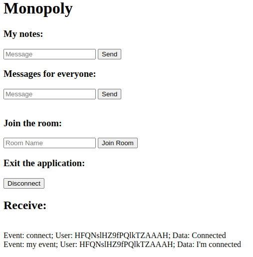
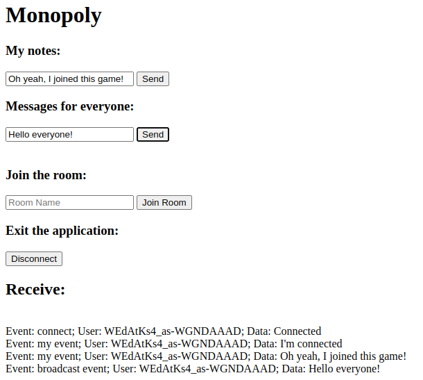
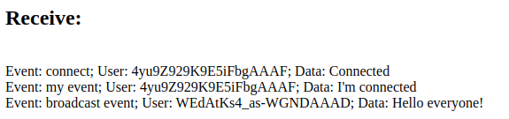
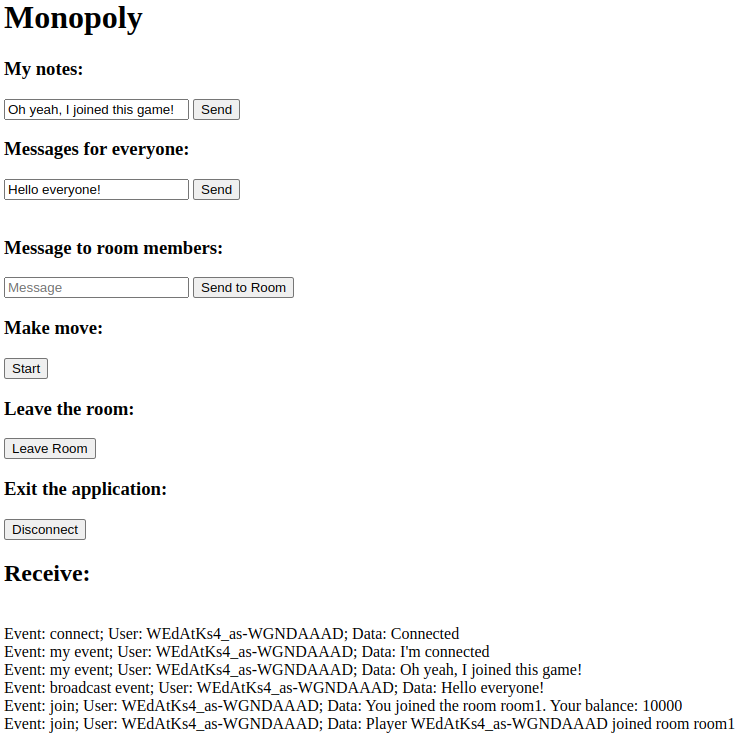
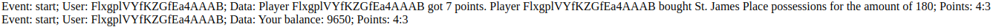
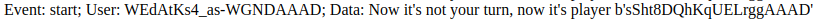

## To start you need
### Fill env
```bash
cp .env.exaple .env
```
### Run Docker
```bash
docker-compose up -d --build
```
### Make migration
```bash
flask db upgrade
```
### Fill database
```bash
python fill_board.py
```
### Run the application
```bash
python main.py
```

Open several browser windows along the path http://0.0.0.0:5000

| Player 1                            | Player 2                            | Player 3                            |
|-------------------------------------|-------------------------------------|-------------------------------------|
|  |  |  |

You have the ability to write messages that are visible only to you, as well as messages that all connected users will see. 
You can write messages inside the room, only members of the current room will see them.
You have the opportunity to add to any room by writing its name. And you can switch off.

| Messages                                                                      | Joining a room                      |
|-------------------------------------------------------------------------------|-------------------------------------|
 |  |  |

Then you can make a move, according to which card you get on, the corresponding actions of the Monopoly game will be made, and you will see the result in the log.



Players make a move in turn, if it is not your turn to make a move, you will see a corresponding message.



If you leave the room, you are out of the game, your purchased cards are erased, you are excluded from the turn to make moves.
